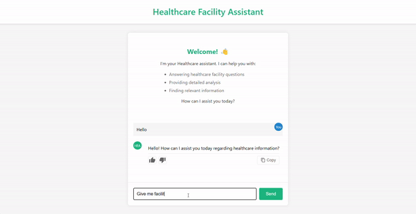

# Healthcare Facility Assistant



Try it out [here!](https://healthcare-facilities.live/)

## Data Description

The data used in this project is sourced from the Kenya Master Health Facility Registry (KMHFR). The KMHFR is a comprehensive database of all health facilities in Kenya. The data is available in a CSV format and will be used to create the tool.

To view the data attributes, check out the data summary in this [documentation](../mage/README.md).

## Project Overview

The Healthcare Facility Assistant is a RAG application for assisting users with their healthcare facilities information needs. The application provides users with the following functionalities:

- Users can search for healthcare facilities by county, sub-county, constituency, ward, facility type, and facility owner. The application will display a list of healthcare facilities that match the search criteria.

- Users can view detailed information about a specific healthcare facility. The application will display information such as the facility name, type, location, and other related information.

- Users can ask questions about healthcare facilities. The application will generate responses to the questions using OpenAI's Language Model (LLM).

The Healthcare Facility Assistant is designed to be user-friendly and intuitive, providing users with easy access to healthcare facilities information. It aims to improve the accessibility of healthcare services and help users make informed decisions about their healthcare needs.

## Technologies

The Healthcare Facility Assistant is built using the following technologies:

- [Minsearch](https://github.com/alexeygrigorev/minsearch): Minimal search engine that provides basic search functionality for text data.

- OpenAI: OpenAI's Language Model (LLM) is a powerful natural language processing model that can generate human-like text.

- FastAPI: A modern web framework for building APIs with Python. It is fast, easy to use, and provides interactive documentation for APIs.

- PostgreSQL: Powerful open-source relational database management system that is used to store and manage the application's data.

- Grafana: Analytics and monitoring platform that provides insights into the application's performance.

- Streamlit: Framework that allows developers to create interactive web applications with simple Python scripts.

- React: JavaScript library for building user interfaces. Used to create the front end of the web application.

- Docker: A platform for developing, shipping, and running applications in containers.

## Run it

Navigate to the `healthcare_assistant` directory from the root directory:

```bash
cd healthcare_assistant
```

Create a `.env` file in the `healthcare_assistant` directory using the `env_example_llm` file as a template:

```bash
cp env_example_llm .env
```

### Running the Application Locally

Install the required packages:

```bash
pip install -r requirements.txt
```

Run the application:

```bash
python app.py
```

### Running the Application with Docker

**Note:** Before running, the application needs to initialize the database connection. To do this manually, use the [`db_prep.py`](healthcare_assistant/db_prep.py) script:

```bash
cd healthcare_assistant

python db_prep.py
```

However, this might cause some issues with the database connection on the host machine. To avoid this, set an environment variable `POSTGRES_HOST` to `postgres` in the `.env` file while pointing the same variable to the host machine `localhost` in the terminal before running docker compose.

```bash
export POSTGRES_HOST=localhost
```

Build the docker image:

```bash
docker build -t healthcare-assistant:v1.0.1 .
```

Run the application using docker:

```bash
docker run -it --rm \
    --env-file .env \
    -p 8000:8000 \
    healthcare-assistant:v1.0.1
```

### Running the Application with Docker Compose

To run the application using **docker compose** you don't need to manually initialize the database connection. The application will automatically connect to the database using the provided environment variables.

Copy and paste this command to start the application:

```bash
docker compose up
```

To stop the application:

```bash
docker compose down -v
```

Navigate to the URL in your browser to access the application. You can view the api documentation at `http://localhost:8000/docs`.

### Using the Application

#### Command Line

You can also use curl to interact with the api via the command line terminal.

To ask a question:

```bash
URL="http://127.0.0.1:8000" 
QUESTION="Is Ankara Medical Centre operational on weekends?" 
DATA='{"question": "'${QUESTION}'"}' 

curl -X POST "${URL}/ask" \
-H "Content-Type: application/json" \
-d "${DATA}"
```

The response will be a JSON object with the generated answer as below:

```json
{
    "conversation_id":"902f9bed-c9e5-4a61-9c85-78d4e622708b",
    "question":"Is Ankara Medical Centre operational on weekends?",
    "result":"No, Ankara Medical Centre is not operational on weekends."
}
```

To send a feedback:

```bash
URL="http://127.0.0.1:8000"
ID="902f9bed-c9e5-4a61-9c85-78d4e622708b"
FEEDBACK_DATA='{"conversation_id": "'${ID}'", "feedback": 1}'

curl -X POST "${URL}/feedback" \
-H "Content-Type: application/json" \
-d "${FEEDBACK_DATA}"
```

The response will be a JSON object with the feedback status as below:

```json
{"message":"Feedback received","conversation_id":"902f9bed-c9e5-4a61-9c85-78d4e622708b","feedback":1}
```

Alternatively, you can use the [test.py](tests/test.py) to test the api endpoints by running the following command:

```bash
cd tests

python test.py
```

#### Localhost User Interface

You can also interact with the application using the web interface. However, you need to spin up the backend server first before running the frontend.
You can follow the steps in the [Running the application with docker compose](#running-the-application-with-docker-compose) section to run the backend.

To run the streamlit app locally, navigate to the `healthcare_assistant/assistant_app` directory and run the following command:

```bash
streamlit run streamlit_app.py
```

Navigate to `http://localhost:8501` in your browser to access the application.


Check out [streamlit_app.py](assistant_app/streamlit_app.py) file for the Streamlit application code.

### Web Interface Deployment

To deploy the user interface, you can use Vercel. Check out the [Frontend Deployment Using Vercel Guide](frontend_deployment.md) for detailed instructions on how to deploy the frontend using Vercel.

To deploy the backend, you can use Heroku. Check out the [Backend Deployment Using Heroku Guide](backend_deployment.md) for detailed instructions on how to deploy the backend using Heroku.

## API

The healthcare assistant application has the following API endpoints:

- `/ask`: This endpoint is used to ask a question to the application. Users can send a POST request with a question in the request body, and the application will generate a response using OpenAI's LLM.

- `/feedback`: This endpoint is used to send feedback to the application. Users can send a POST request with the conversation ID and feedback score in the request body, and the application will use the feedback to improve the quality of responses.

- `/docs`: This endpoint provides interactive documentation for the API. Users can view the available endpoints, request parameters, and response formats.

To learn more about fastapi, check out the [official documentation](https://fastapi.tiangolo.com/).

## Ingestion

The ingestion script is located in the file [ingest.py](healthcare_assistant/healthcare_assistant_app/ingest.py)

## Evaluation

The evaluation of the Healthcare Assistant application was done using the following metrics:

- Hit Rate: The proportion of queries for which the application returned a relevant response.
- Mean Reciprocal Rank (MRR): The average of the reciprocal ranks of the first relevant response for each query.

The evaluation data was generated using a retrieval model to generate responses. This data was then used to evaluate the relevance of the model responses through calculation of the hit rate and Mean Reciprocal Rank metrics.

Check out the evaluation data generation code [evaluation_data_generation.ipynb](notebooks/evaluation_data_generation.ipynb). You can also see this notebook code for the evaluation [health_rag_flow.ipynb](notebooks/health_rag_flow.ipynb)

There's also a python file [evaluation_data_generator](assistant_app/evaluation_data_generator.py) that generates the ground truth data for evaluation.

You can set up a cron job to run the script at a specific time to generate the ground truth data.

```bash
crontab -e
```

Add the following line to the crontab file to run the script every day at 12:00 AM:

```bash
0 0 * * * /usr/bin/python3 /path/to/healthcare-facilities/healthcare_assistant/assistant_app/evaluation_data_generator.py
```

### Retrieval

The basic approach - using minsearch without any boosting - gave the following metrics:

- hit_rate: 0.61
- mrr: 0.50

The improved approach - using minsearch with boosting - gave the following metrics:

- hit_rate: 0.79
- mrr: 0.86

### RAG flow

The RAG flow evaluation was implemented using the LLM-as-a-Judge metric.

Among the ground truth records, there were 79 records that were relevant to the query, 11 records that were non-relevant, and 9 records that were partly relevant.

For gpt-4o, in a sample of 100 queries, the code cell and results were as follows:

```python
df_eval.relevance.value_counts()
```

```python
relevance

RELEVANT           79
NON_RELEVANT       11
PARTLY_RELEVANT    9
```

## Monitoring

The application is leveraging Grafana for monitoring. The dashboard provides insights into the application's performance; including relevance, response times, feedback statistics, model used, token usage, and recent conversations.


The dashboard is updated in real-time and provides a comprehensive view of the application's performance.

Click [here](grafana/grafana_queries.md) to see the queries used in the dashboard. You can also import the dashboard from the [grafana](grafana) directory.

## References

- [Kenya Master Health Facility List (KMHFR)](https://KMHFR.health.go.ke/)
- [FastAPI Documentation](https://fastapi.tiangolo.com/)
- [Streamlit Documentation](https://docs.streamlit.io/)
- [OpenAI API Documentation](https://beta.openai.com/docs/)
- [DataTalks.Club](https://datatalks.club/)
- [Grafana](https://grafana.com/docs/grafana/latest/)
